42O DayZ Wiki
=======

### Welcome to the 42O DayZ SA-MP server wikipedia page!

-----
Items
-----
Tip: To pickup item you need first to press key 'C' (to player crouch) and then press key 'LALT'.

Note: To perform an action with an item, you must open the `Inventory` gui with pressing key 'Y'!

| Name |  Picture | Type | Info |
| :--- | :----: | :----: | --: |
| Red Apple | 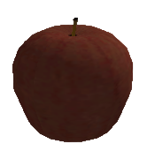 | Food | It reduces hunger, and thirst by 30.0%  |
| Green Apple | 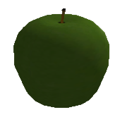 | Food | It reduces hunger, and thirst by 30.0% |
| Orange |  | Food | It reduces hunger, and thirst by 30.0% |
| Tomato | 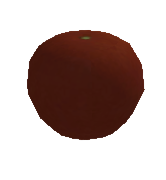 | Food | It reduces hunger |
| Burger | 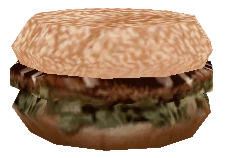 | Food | It reduces hunger |
| Banana |  | Food | It reduces hunger |
| Taco | 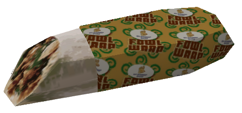 | Food | It reduces hunger |
| Pizza | 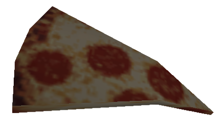 | Food | It reduces hunger |
| Bread | 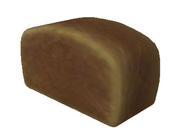 | Food | It reduces hunger |
| Pumpkin | 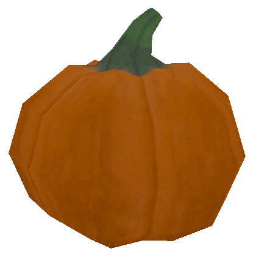 | Food | It reduces hunger |
| Fish | 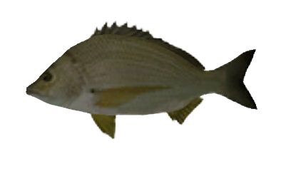 | Food | It reduces hunger |
| Coffee | 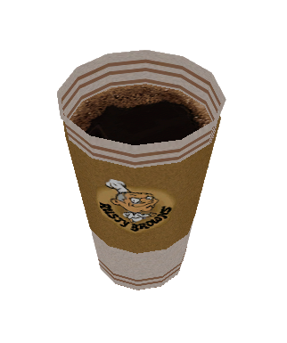 | Drink | It reduces thirst |
| Milk | 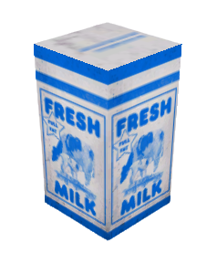 | Drink | It reduces thirst |
| Juice Orange | 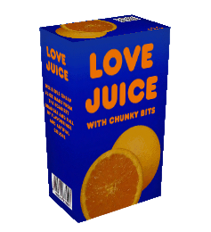 | Drink | It reduces thirst |
| Juice Apple | 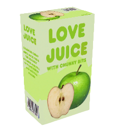 | Drink | It reduces thirst |
| Whiskey | 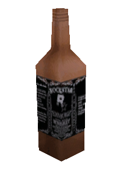 | Drink | It reduces thirst, and increases drunk level, if you use too much alcohol you can die. |
| Beer | 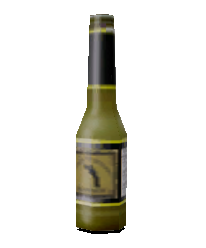 | Drink | It reduces thirst, and increases drunk level, if you use too much alcohol you can die. |
| Wine | 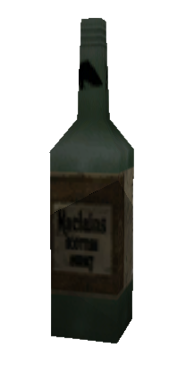 | Drink | It reduces thirst, and increases drunk level, if you use too much alcohol you can die. |
| Empty watterbotle | 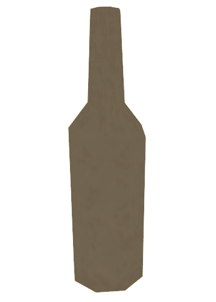 | Not Drinkable | This item is created by wearing the item 'Waterbottle', and can be used if the player is close to water, he can fill it with water
| Watterbotle |  | Drink | Reduces thirst, and after using this item, 'Empty Waterbottle' is created |
| Stock | 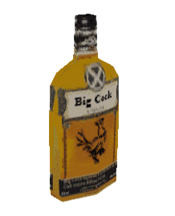 | Drink | It reduces thirst, and increases drunk level, if you use too much alcohol you can die. |
| Silencer | 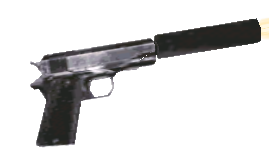 | Weapon |
| Desert Eagle | 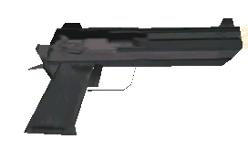 | Weapon |
| Shotgun | 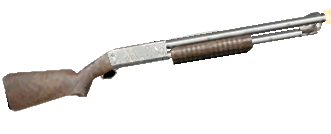 | Weapon |
| Mp5 | 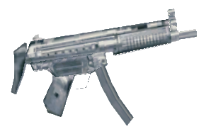 | Weapon |
| AK-47 | 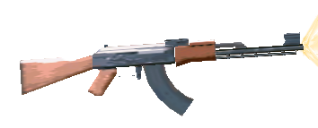 | Weapon |
| M4 | 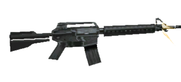 | Weapon |
| Tec-9 | 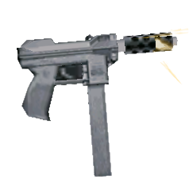 | Weapon |
| Country Rifle | 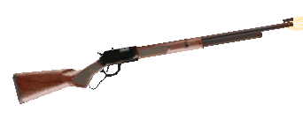 | Weapon |
| Sniper Rifle | 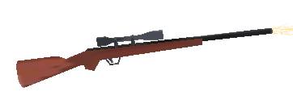 | Weapon |
| Sawnoff | 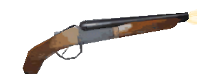 | Weapon |
| Pistol Ammo | 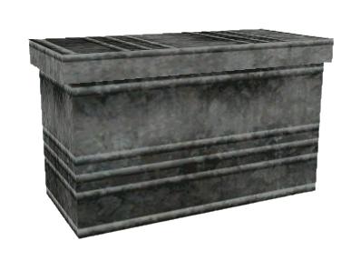 | Ammo |
| Assault Ammo | 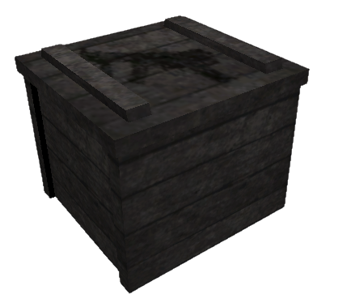 | Ammo |
| Shotgun Ammo | 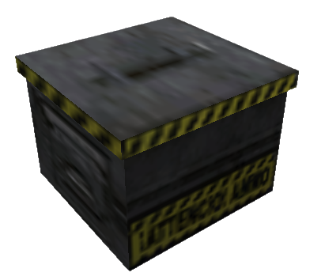 | Ammo |
| Rifle Ammo | 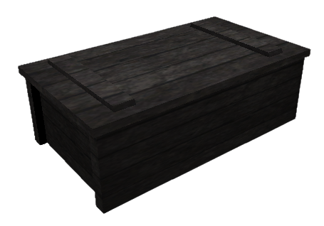 | Ammo |
| Medkit | 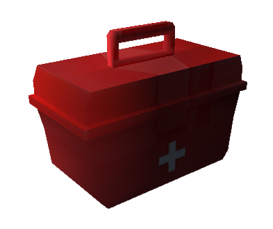 | Health | Set the health to 100.0 |
| First kit | 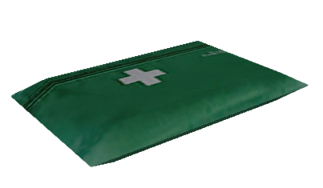 | Health | Raises health by 50.0 |
| Armour Body | 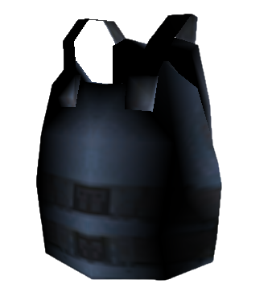 | Health | Set the armour to 100.0 |
| Bandage | 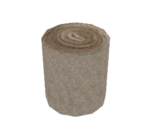 | Health | Raises health by 20.0 |
| Helmet |  | Health | Protection from headshot |
| Black Backpack | 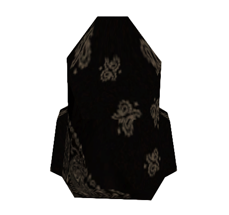 | Storage | 1 Page, 8 Slots |
| Yellow Backpack | 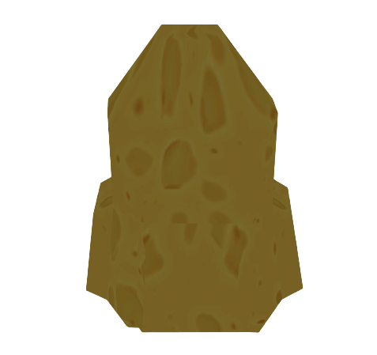 | Storage | 2 Pages, 16 Slots |
| Red Backpack | 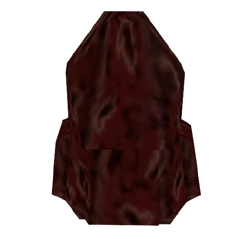 | Storage | 3 Pages, 24 Slots |
| VIP Backpack | 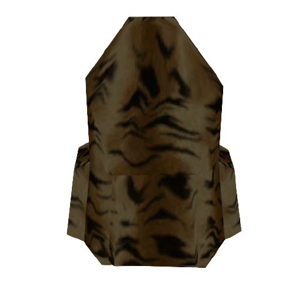 | Storage | 5 Page, 40 Slot |
| Leaf Backpack | 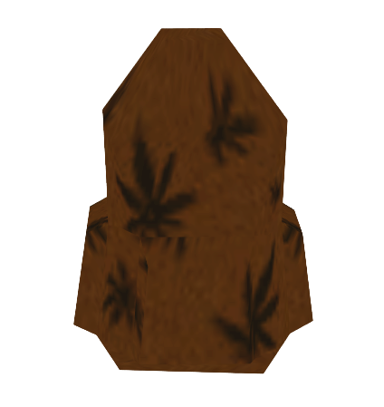 | Storage | 6 Page, 48 Slot |
| Apple Seeds | 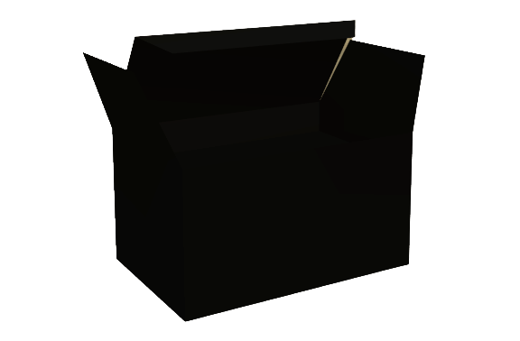 | Seeds | Growing Apple Tree |
| Orange Seeds |  | Seeds | Growing Orange Tree |
| Banana Seeds |  | Seeds | Growing Banana Tree |
| Tomato Seeds |  | Seeds | Growing Tomato Tree |
| Pumpkin Seeds |  | Seeds | Growing Pumpkins |
| Weed Seeds |  | Seeds | Growing Weed |
| Shovel | 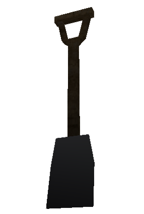 | Farm | Necessary for growing plants |
| Plant Pot | 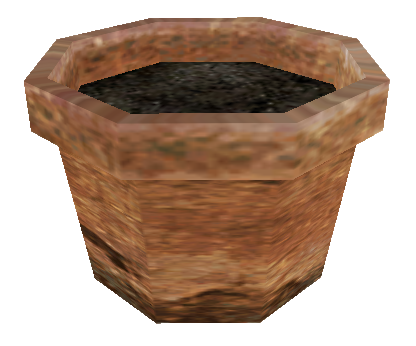 | Farm | Necessary for growing plants |
| Fertilizer | 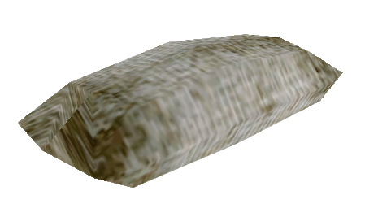 | Farm | Necessary for growing plants |
| Ghillie | 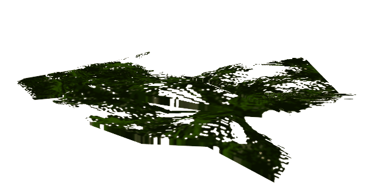 | Speical | Ghillie clothes |
| Util Joint | 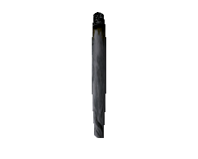 | Speical | Smoking weed | 
| Ganja | 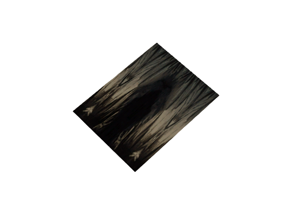 | Speical | They were obtained after growing plant 'Weed', uses for smoking 'Util Joint' | 
| RedBull | 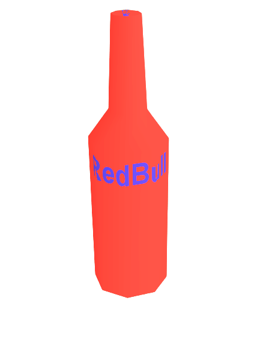 | Drink Special | Resync stamina (client) |
| Tent | 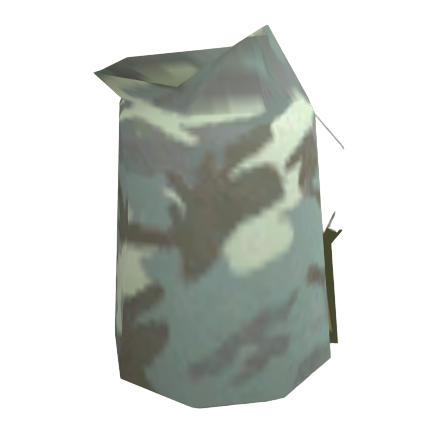 | Tent Storage | Planting private tent with only your access |
| Fishing Rod |  | Tools | It is used for fishing, command: `/fishing` |

Zombies
-------
-----
##### Zombies on the server have a special artificial intelligence, with which they attack all players, you have to be very careful because at a certain interval zombies are created behind you. Zombies can be set by the Administrator, from the settings there are:

Spawn time: `5 - 15 minutes`.
Respawn time: `2 - 10 minutes`. 
Damage per hit: `5.0 - 90.0 damage`. 
Running style: `Fast or Slow`.

Note: Zombies can hear your shooting, if you are close to them and they will move in the direction where you last shot!

-----
Crates
-----
Tip: To loot the crate you need first to press key 'C' (to player crouch) and then press key 'LALT'.

Note: Every 30 minutes crate loot will be respawned!

| Type |  Picture | Info |
| :--- | :----: | --: |
| Weapon |  | 10 random weapon and ammo items |
| Medic |  | 10 random health items |
| Farm |  | 10 random farm items |
| Drink |  | 10 random drink items |
| Food |  | 10 random food items |

-----
Weapons
-----

---

#### **Melee weapons:**
##### Brass Knuckles 
&nbsp;&nbsp;&nbsp;&nbsp;&nbsp;&nbsp; You always spawn with Brass Knuckles, very basic melee weapon. 
&nbsp;&nbsp;&nbsp;&nbsp;&nbsp;&nbsp; How to get: Upon spawning. Can't be looted.
#### **Handguns:**
##### &nbsp;&nbsp;&nbsp;&nbsp;&nbsp;&nbsp;&nbsp;&nbsp;&nbsp;&nbsp;&nbsp;&nbsp; Silenced Pistol 
&nbsp;&nbsp;&nbsp;&nbsp;&nbsp;&nbsp;&nbsp;&nbsp;&nbsp;&nbsp;&nbsp;&nbsp;&nbsp;&nbsp;&nbsp;&nbsp;&nbsp;&nbsp; You always spawn with a Silenced Pistol which has 17 ammunition. 
&nbsp;&nbsp;&nbsp;&nbsp;&nbsp;&nbsp;&nbsp;&nbsp;&nbsp;&nbsp;&nbsp;&nbsp;&nbsp;&nbsp;&nbsp;&nbsp;&nbsp;&nbsp; How to get: `Upon spawning or looting`. 
&nbsp;&nbsp;&nbsp;&nbsp;&nbsp;&nbsp;&nbsp;&nbsp;&nbsp;&nbsp;&nbsp;&nbsp;&nbsp;&nbsp;&nbsp;&nbsp;&nbsp;&nbsp; **Ammunition type:** `Pistol ammo`.
##### &nbsp;&nbsp;&nbsp;&nbsp;&nbsp;&nbsp;&nbsp;&nbsp;&nbsp;&nbsp;&nbsp;&nbsp; Desert Eagle 
&nbsp;&nbsp;&nbsp;&nbsp;&nbsp;&nbsp;&nbsp;&nbsp;&nbsp;&nbsp;&nbsp;&nbsp;&nbsp;&nbsp;&nbsp;&nbsp;&nbsp;&nbsp; Desert Eagle is one of the most common weapons used in 42O DayZ due to its very high damage value. 
&nbsp;&nbsp;&nbsp;&nbsp;&nbsp;&nbsp;&nbsp;&nbsp;&nbsp;&nbsp;&nbsp;&nbsp;&nbsp;&nbsp;&nbsp;&nbsp;&nbsp;&nbsp; How to get: `Looting`. 
&nbsp;&nbsp;&nbsp;&nbsp;&nbsp;&nbsp;&nbsp;&nbsp;&nbsp;&nbsp;&nbsp;&nbsp;&nbsp;&nbsp;&nbsp;&nbsp;&nbsp;&nbsp; **Ammunition type:** `Pistol ammo`.
#### **Shotguns:**
##### &nbsp;&nbsp;&nbsp;&nbsp;&nbsp;&nbsp;&nbsp;&nbsp;&nbsp;&nbsp;&nbsp;&nbsp; Pump-Action Shotgun(In-game: Shotgun)
&nbsp;&nbsp;&nbsp;&nbsp;&nbsp;&nbsp;&nbsp;&nbsp;&nbsp;&nbsp;&nbsp;&nbsp;&nbsp;&nbsp;&nbsp;&nbsp;&nbsp;&nbsp; Shotgun is a very good weapon if you are in a close range combat. Shotgun is also very good due to its bullet spreading, 
&nbsp;&nbsp;&nbsp;&nbsp;&nbsp;&nbsp;&nbsp;&nbsp;&nbsp;&nbsp;&nbsp;&nbsp;&nbsp;&nbsp;&nbsp;&nbsp;&nbsp;&nbsp; which you can use as your advantage to shoot people who are hiding behind pillars, for example.
&nbsp;&nbsp;&nbsp;&nbsp;&nbsp;&nbsp;&nbsp;&nbsp;&nbsp;&nbsp;&nbsp;&nbsp;&nbsp;&nbsp;&nbsp;&nbsp;&nbsp;&nbsp; How to get: `Looting`. 
&nbsp;&nbsp;&nbsp;&nbsp;&nbsp;&nbsp;&nbsp;&nbsp;&nbsp;&nbsp;&nbsp;&nbsp;&nbsp;&nbsp;&nbsp;&nbsp;&nbsp;&nbsp; **Ammunition type:** `Shotgun ammo`.
##### &nbsp;&nbsp;&nbsp;&nbsp;&nbsp;&nbsp;&nbsp;&nbsp;&nbsp;&nbsp;&nbsp;&nbsp; Sawn-Off Shotgun(In-game: Sawnoff) 
&nbsp;&nbsp;&nbsp;&nbsp;&nbsp;&nbsp;&nbsp;&nbsp;&nbsp;&nbsp;&nbsp;&nbsp;&nbsp;&nbsp;&nbsp;&nbsp;&nbsp;&nbsp; Sawnoff is a weak weapon in DayZ. 
&nbsp;&nbsp;&nbsp;&nbsp;&nbsp;&nbsp;&nbsp;&nbsp;&nbsp;&nbsp;&nbsp;&nbsp;&nbsp;&nbsp;&nbsp;&nbsp;&nbsp;&nbsp; Its only advantage is its bullet spreading as you have better chances at shooting someone into their head.
&nbsp;&nbsp;&nbsp;&nbsp;&nbsp;&nbsp;&nbsp;&nbsp;&nbsp;&nbsp;&nbsp;&nbsp;&nbsp;&nbsp;&nbsp;&nbsp;&nbsp;&nbsp; How to get: `Looting`. 
&nbsp;&nbsp;&nbsp;&nbsp;&nbsp;&nbsp;&nbsp;&nbsp;&nbsp;&nbsp;&nbsp;&nbsp;&nbsp;&nbsp;&nbsp;&nbsp;&nbsp;&nbsp; **Ammunition type:** `Shotgun ammo`.
#### **Assault Rifles:**
##### &nbsp;&nbsp;&nbsp;&nbsp;&nbsp;&nbsp;&nbsp;&nbsp;&nbsp;&nbsp;&nbsp;&nbsp;AK-47(In-game: AK 47)
&nbsp;&nbsp;&nbsp;&nbsp;&nbsp;&nbsp;&nbsp;&nbsp;&nbsp;&nbsp;&nbsp;&nbsp;&nbsp;&nbsp;&nbsp;&nbsp;&nbsp;&nbsp; AK 47 is a very good weapon and due to its spread and recoil, it's quite easy to shoot people into their head. 
&nbsp;&nbsp;&nbsp;&nbsp;&nbsp;&nbsp;&nbsp;&nbsp;&nbsp;&nbsp;&nbsp;&nbsp;&nbsp;&nbsp;&nbsp;&nbsp;&nbsp;&nbsp; AK 47 is a powerful weapon to use in long range gunfights. 
&nbsp;&nbsp;&nbsp;&nbsp;&nbsp;&nbsp;&nbsp;&nbsp;&nbsp;&nbsp;&nbsp;&nbsp;&nbsp;&nbsp;&nbsp;&nbsp;&nbsp;&nbsp; How to get: `Looting`. 
&nbsp;&nbsp;&nbsp;&nbsp;&nbsp;&nbsp;&nbsp;&nbsp;&nbsp;&nbsp;&nbsp;&nbsp;&nbsp;&nbsp;&nbsp;&nbsp;&nbsp;&nbsp; **Ammunition type:** `Assault ammo`.
##### &nbsp;&nbsp;&nbsp;&nbsp;&nbsp;&nbsp;&nbsp;&nbsp;&nbsp;&nbsp;&nbsp;&nbsp;M4 
&nbsp;&nbsp;&nbsp;&nbsp;&nbsp;&nbsp;&nbsp;&nbsp;&nbsp;&nbsp;&nbsp;&nbsp;&nbsp;&nbsp;&nbsp;&nbsp;&nbsp;&nbsp; M4 is a powerful weapon to use in long range gunfights. 
&nbsp;&nbsp;&nbsp;&nbsp;&nbsp;&nbsp;&nbsp;&nbsp;&nbsp;&nbsp;&nbsp;&nbsp;&nbsp;&nbsp;&nbsp;&nbsp;&nbsp;&nbsp;How to get: `Looting`. 
&nbsp;&nbsp;&nbsp;&nbsp;&nbsp;&nbsp;&nbsp;&nbsp;&nbsp;&nbsp;&nbsp;&nbsp;&nbsp;&nbsp;&nbsp;&nbsp;&nbsp;&nbsp; **Ammunition type:** `Assault ammo`.
#### **Rifles:**
##### &nbsp;&nbsp;&nbsp;&nbsp;&nbsp;&nbsp;&nbsp;&nbsp;&nbsp;&nbsp;&nbsp;&nbsp;Country Rifle
&nbsp;&nbsp;&nbsp;&nbsp;&nbsp;&nbsp;&nbsp;&nbsp;&nbsp;&nbsp;&nbsp;&nbsp;&nbsp;&nbsp;&nbsp;&nbsp;&nbsp;&nbsp; Rifle is definitely a way to go if you don't have a sniper.
&nbsp;&nbsp;&nbsp;&nbsp;&nbsp;&nbsp;&nbsp;&nbsp;&nbsp;&nbsp;&nbsp;&nbsp;&nbsp;&nbsp;&nbsp;&nbsp;&nbsp;&nbsp; How to get: `Looting`. 
&nbsp;&nbsp;&nbsp;&nbsp;&nbsp;&nbsp;&nbsp;&nbsp;&nbsp;&nbsp;&nbsp;&nbsp;&nbsp;&nbsp;&nbsp;&nbsp;&nbsp;&nbsp; **Ammunition type:** `Rifle ammo`.
##### &nbsp;&nbsp;&nbsp;&nbsp;&nbsp;&nbsp;&nbsp;&nbsp;&nbsp;&nbsp;&nbsp;&nbsp;Sniper Rifle(In-game: Sniper)
&nbsp;&nbsp;&nbsp;&nbsp;&nbsp;&nbsp;&nbsp;&nbsp;&nbsp;&nbsp;&nbsp;&nbsp;&nbsp;&nbsp;&nbsp;&nbsp;&nbsp;&nbsp; Sniper is one of the most used weapon in DayZ due to its very high damage value.
&nbsp;&nbsp;&nbsp;&nbsp;&nbsp;&nbsp;&nbsp;&nbsp;&nbsp;&nbsp;&nbsp;&nbsp;&nbsp;&nbsp;&nbsp;&nbsp;&nbsp;&nbsp; How to get: `Looting`. 
&nbsp;&nbsp;&nbsp;&nbsp;&nbsp;&nbsp;&nbsp;&nbsp;&nbsp;&nbsp;&nbsp;&nbsp;&nbsp;&nbsp;&nbsp;&nbsp;&nbsp;&nbsp; **Ammunition type:** `Rifle ammo`.
#### **Sub-Machine Guns:**
##### &nbsp;&nbsp;&nbsp;&nbsp;&nbsp;&nbsp;&nbsp;&nbsp;&nbsp;&nbsp;&nbsp;&nbsp;Tec-9(In-game: Tec)
&nbsp;&nbsp;&nbsp;&nbsp;&nbsp;&nbsp;&nbsp;&nbsp;&nbsp;&nbsp;&nbsp;&nbsp;&nbsp;&nbsp;&nbsp;&nbsp;&nbsp;&nbsp; Tec is a weak weapon in DayZ. 
&nbsp;&nbsp;&nbsp;&nbsp;&nbsp;&nbsp;&nbsp;&nbsp;&nbsp;&nbsp;&nbsp;&nbsp;&nbsp;&nbsp;&nbsp;&nbsp;&nbsp;&nbsp; Its only advantage is its bullet spreading as you have better chances at shooting someone into their head.
&nbsp;&nbsp;&nbsp;&nbsp;&nbsp;&nbsp;&nbsp;&nbsp;&nbsp;&nbsp;&nbsp;&nbsp;&nbsp;&nbsp;&nbsp;&nbsp;&nbsp;&nbsp; Tec can't be dual wielded in 42O DayZ. 
&nbsp;&nbsp;&nbsp;&nbsp;&nbsp;&nbsp;&nbsp;&nbsp;&nbsp;&nbsp;&nbsp;&nbsp;&nbsp;&nbsp;&nbsp;&nbsp;&nbsp;&nbsp; How to get: `Looting`. 
&nbsp;&nbsp;&nbsp;&nbsp;&nbsp;&nbsp;&nbsp;&nbsp;&nbsp;&nbsp;&nbsp;&nbsp;&nbsp;&nbsp;&nbsp;&nbsp;&nbsp;&nbsp; **Ammunition type:** `SMG ammo`.
##### &nbsp;&nbsp;&nbsp;&nbsp;&nbsp;&nbsp;&nbsp;&nbsp;&nbsp;&nbsp;&nbsp;&nbsp;SMG(In-game: MP5)
&nbsp;&nbsp;&nbsp;&nbsp;&nbsp;&nbsp;&nbsp;&nbsp;&nbsp;&nbsp;&nbsp;&nbsp;&nbsp;&nbsp;&nbsp;&nbsp;&nbsp;&nbsp; MP5 is a powerful weapon and in most cases will be an instant kill to the head due to its recoil. 
&nbsp;&nbsp;&nbsp;&nbsp;&nbsp;&nbsp;&nbsp;&nbsp;&nbsp;&nbsp;&nbsp;&nbsp;&nbsp;&nbsp;&nbsp;&nbsp;&nbsp;&nbsp; It's recommended to use MP5 over Tec. 
&nbsp;&nbsp;&nbsp;&nbsp;&nbsp;&nbsp;&nbsp;&nbsp;&nbsp;&nbsp;&nbsp;&nbsp;&nbsp;&nbsp;&nbsp;&nbsp;&nbsp;&nbsp; How to get: `Looting`. 
&nbsp;&nbsp;&nbsp;&nbsp;&nbsp;&nbsp;&nbsp;&nbsp;&nbsp;&nbsp;&nbsp;&nbsp;&nbsp;&nbsp;&nbsp;&nbsp;&nbsp;&nbsp; **Ammunition type:** `SMG ammo`.

Tip: You can add ammo from other weapon if that weapons have both same **Ammunition type**

Note: Actions in `Inventory` gui, for weapons are only `Drop` and `Equip` / `Unequip`!

---