42O DayZ Wiki
=======

### Welcome to the 42O DayZ SA-MP server wikipedia page!

-----
Items
-----
Tip: To pickup item you need first to press key 'C' (to player crouch) and then press key 'LALT'.

Note: To perform an action with an item, you must open the `Inventory` gui with pressing key 'Y'!

| Name |  Picture | Type | Info |
| :--- | :----: | :----: | --: |
| Red Apple |  | Food | It reduces hunger, and thirst by 30.0%  |
| Green Apple | 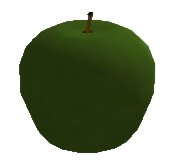 | Food | It reduces hunger, and thirst by 30.0% |
| Orange |  | Food | It reduces hunger, and thirst by 30.0% |
| Tomato | 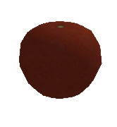 | Food | It reduces hunger |
| Burger | 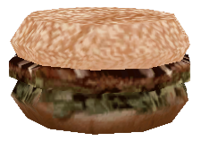 | Food | It reduces hunger |
| Banana | 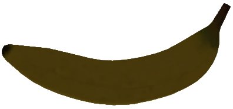 | Food | It reduces hunger |
| Taco | 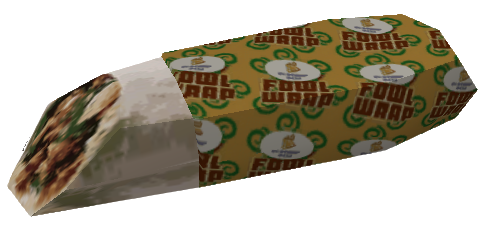 | Food | It reduces hunger |
| Pizza | 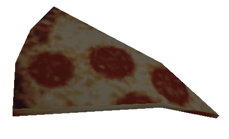 | Food | It reduces hunger |
| Bread | 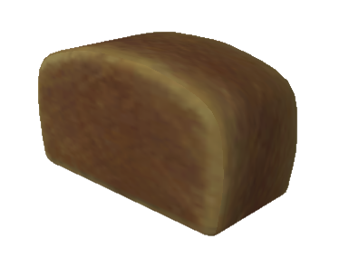 | Food | It reduces hunger |
| Pumpkin | 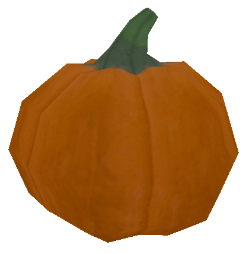 | Food | It reduces hunger |
| Fish | 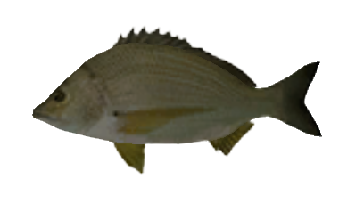 | Food | It reduces hunger |
| Coffee | 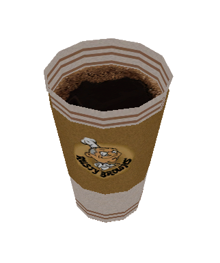 | Drink | It reduces thirst |
| Milk | 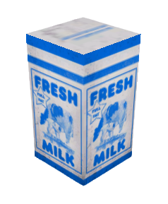 | Drink | It reduces thirst |
| Juice Orange | 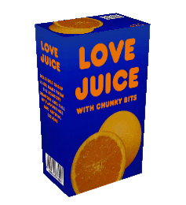 | Drink | It reduces thirst |
| Juice Apple | 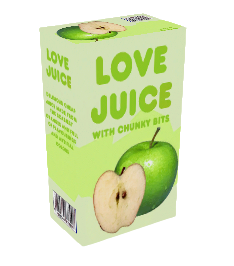 | Drink | It reduces thirst |
| Whiskey | 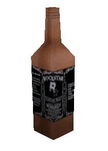 | Drink | It reduces thirst, and increases drunk level, if you use too much alcohol you can die. |
| Beer | 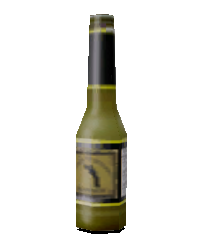 | Drink | It reduces thirst, and increases drunk level, if you use too much alcohol you can die. |
| Wine | 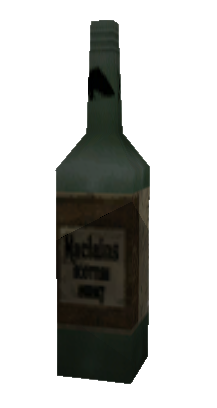 | Drink | It reduces thirst, and increases drunk level, if you use too much alcohol you can die. |
| Empty watterbotle | 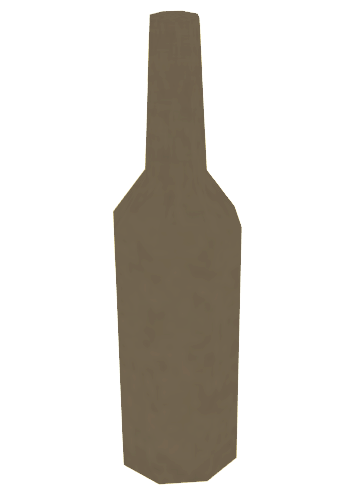 | Not Drinkable | This item is created by wearing the item 'Waterbottle', and can be used if the player is close to water, he can fill it with water
| Watterbotle | 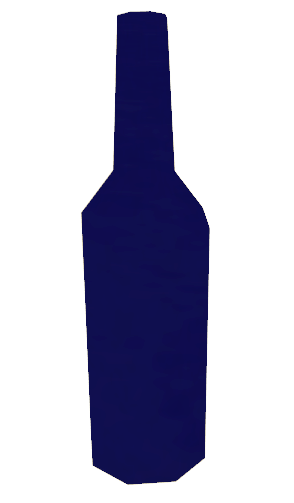 | Drink | Reduces thirst, and after using this item, 'Empty Waterbottle' is created |
| Stock |  | Drink | It reduces thirst, and increases drunk level, if you use too much alcohol you can die. |
| Silencer | 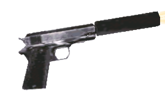 | Weapon |
| Desert Eagle | 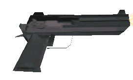 | Weapon |
| Shotgun | 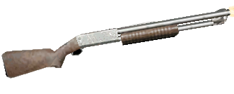 | Weapon |
| Mp5 |  | Weapon |
| AK-47 | 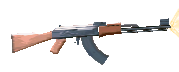 | Weapon |
| M4 | 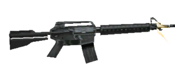 | Weapon |
| Tec-9 | 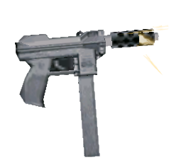 | Weapon |
| Country Rifle | 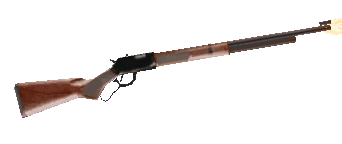 | Weapon |
| Sniper Rifle | 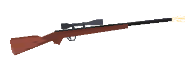 | Weapon |
| Sawnoff | 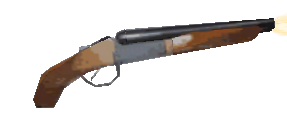 | Weapon |
| Pistol Ammo | 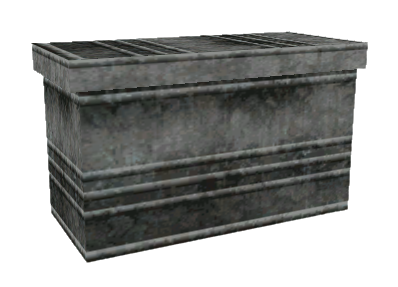 | Ammo |
| Assault Ammo | 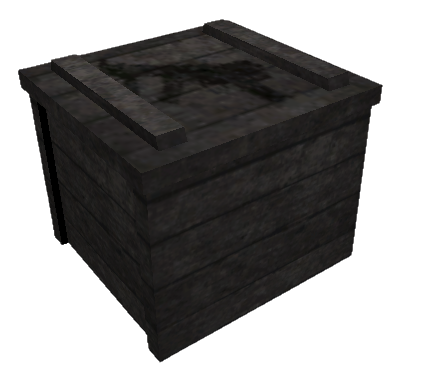 | Ammo |
| Shotgun Ammo | 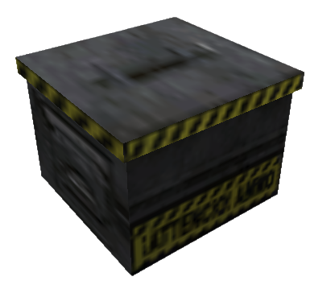 | Ammo |
| Rifle Ammo | 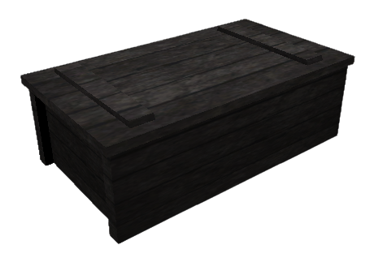 | Ammo |
| Medkit |  | Health | Set the health to 100.0 |
| First kit | 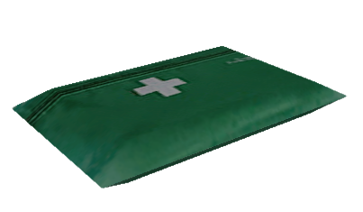 | Health | Raises health by 50.0 |
| Armour Body |  | Health | Set the armour to 100.0 |
| Bandage | 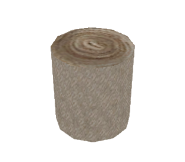 | Health | Raises health by 20.0 |
| Helmet | 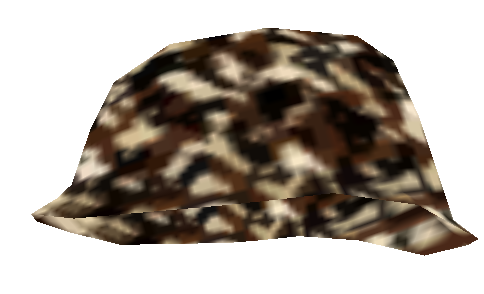 | Health | Protection from headshot |
| Black Backpack | 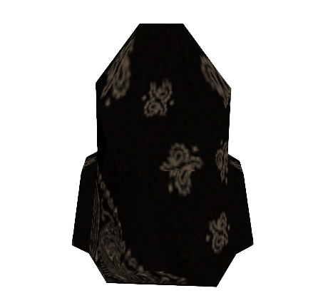 | Storage | 1 Page, 8 Slots |
| Yellow Backpack | 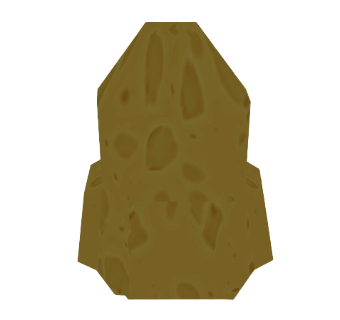 | Storage | 2 Pages, 16 Slots |
| Red Backpack | 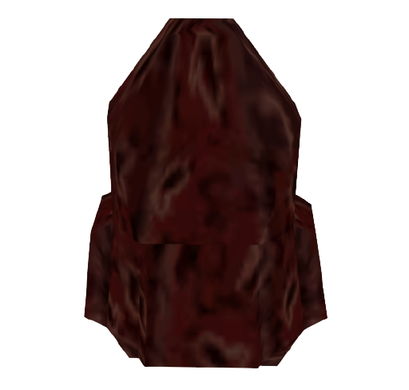 | Storage | 3 Pages, 24 Slots |
| VIP Backpack | 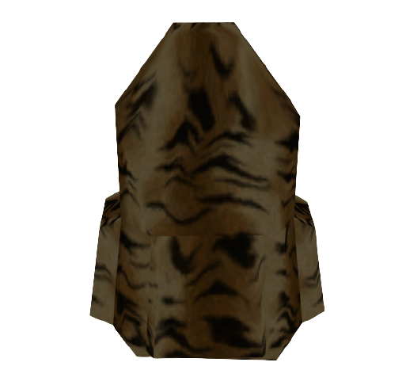 | Storage | 5 Page, 40 Slot |
| Leaf Backpack | 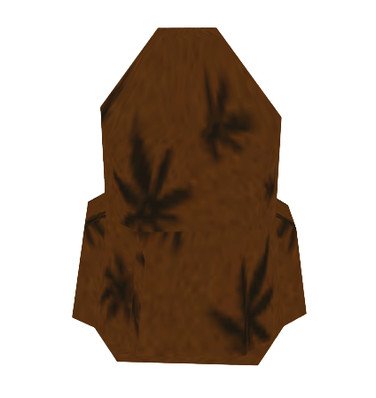 | Storage | 6 Page, 48 Slot |
| Apple Seeds | 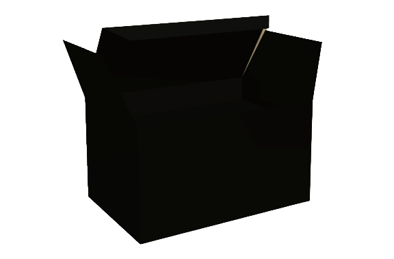 | Seeds | Growing Apple Tree |
| Orange Seeds |  | Seeds | Growing Orange Tree |
| Banana Seeds |  | Seeds | Growing Banana Tree |
| Tomato Seeds |  | Seeds | Growing Tomato Tree |
| Pumpkin Seeds |  | Seeds | Growing Pumpkins |
| Weed Seeds |  | Seeds | Growing Weed |
| Shovel | 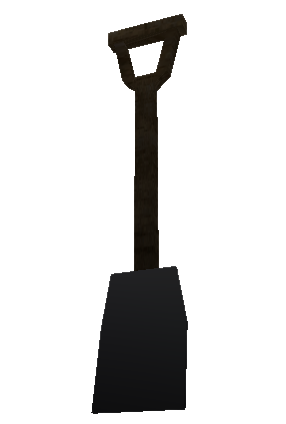 | Farm | Necessary for growing plants |
| Plant Pot | 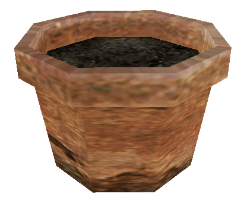 | Farm | Necessary for growing plants |
| Fertilizer | 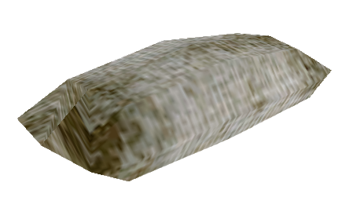 | Farm | Necessary for growing plants |
| Ghillie | 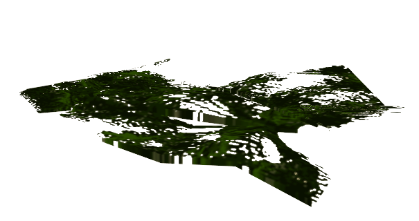 | Special | Ghillie clothes |
| Util Joint | 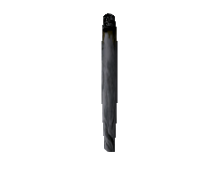 | Special | Smoking weed | 
| Ganja | 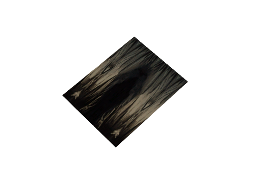 | Special | They were obtained after growing plant 'Weed', uses for smoking 'Util Joint' | 
| RedBull | 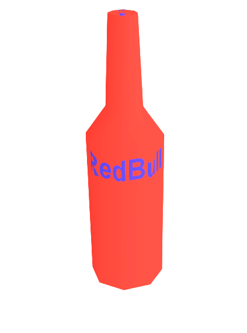 | Drink Special | Resync stamina (client) |
| Tent | 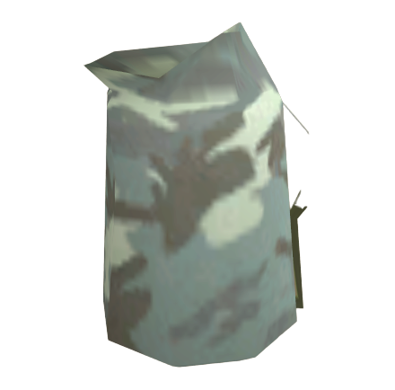 | Tent Storage | Planting private tent with only your access |
| Fishing Rod | 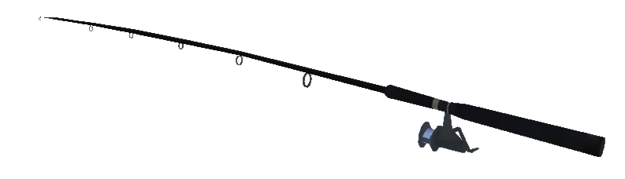 | Tools | It is used for fishing, command: `/fishing` |

-----
Tent
-------
Tip: To loot the tent you need first to press key 'C' (to player crouch) and then press key 'LALT'.

Warning: Placing tent in bad surface can result moving or deleting tent by Administrators
##### Tent is is your private storage for your items, only you can access to the tent.
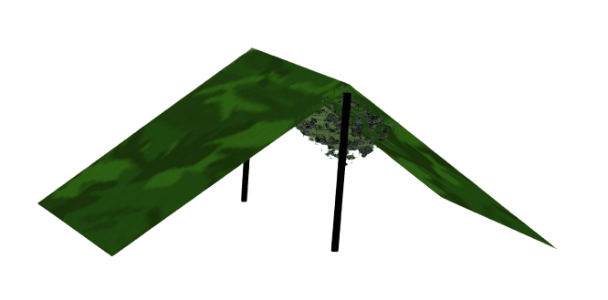

Page slots: `5 pages`.
Slots per page: `8 slots`.
Total capacity: `40 items`.

Zombies
-------
-----
##### Zombies on the server have a special artificial intelligence, with which they attack all players, you have to be very careful because at a certain interval zombies are created behind you. Zombies can be set by the Administrator, from the settings there are:

Spawn time: `5 - 15 minutes`.
Respawn time: `2 - 10 minutes`. 
Damage per hit: `5.0 - 90.0 damage`. 
Running style: `Fast or Slow`.

Note: Zombies can hear your shooting, if you are close to them and they will move in the direction where you last shot, however this does not apply for `Silencer`.

-----
Crates
-----
Tip: To loot the crate you need first to press key 'C' (to player crouch) and then press key 'LALT'.

Note: Every 30 minutes crate loot will be respawned!

| Type |  Picture | Info |
| :--- | :----: | --: |
| Weapon |  | 10 random weapon and ammo items |
| Medic |  | 10 random health items |
| Farm |  | 10 random farm items |
| Drink |  | 10 random drink items |
| Food |  | 10 random food items |

-----
Weapons
-----

---

#### **Melee weapons:**
##### Brass Knuckles 
&nbsp;&nbsp;&nbsp;&nbsp;&nbsp;&nbsp; You always spawn with Brass Knuckles, very basic melee weapon. 
&nbsp;&nbsp;&nbsp;&nbsp;&nbsp;&nbsp; How to get: Upon spawning. Can't be looted.
#### **Handguns:**
##### &nbsp;&nbsp;&nbsp;&nbsp;&nbsp;&nbsp;&nbsp;&nbsp;&nbsp;&nbsp;&nbsp;&nbsp; Silenced Pistol 
&nbsp;&nbsp;&nbsp;&nbsp;&nbsp;&nbsp;&nbsp;&nbsp;&nbsp;&nbsp;&nbsp;&nbsp;&nbsp;&nbsp;&nbsp;&nbsp;&nbsp;&nbsp; You always spawn with a Silenced Pistol which has 17 ammunition. 
&nbsp;&nbsp;&nbsp;&nbsp;&nbsp;&nbsp;&nbsp;&nbsp;&nbsp;&nbsp;&nbsp;&nbsp;&nbsp;&nbsp;&nbsp;&nbsp;&nbsp;&nbsp; How to get: `Upon spawning or looting`. 
&nbsp;&nbsp;&nbsp;&nbsp;&nbsp;&nbsp;&nbsp;&nbsp;&nbsp;&nbsp;&nbsp;&nbsp;&nbsp;&nbsp;&nbsp;&nbsp;&nbsp;&nbsp; **Ammunition type:** `Pistol ammo`.
##### &nbsp;&nbsp;&nbsp;&nbsp;&nbsp;&nbsp;&nbsp;&nbsp;&nbsp;&nbsp;&nbsp;&nbsp; Desert Eagle 
&nbsp;&nbsp;&nbsp;&nbsp;&nbsp;&nbsp;&nbsp;&nbsp;&nbsp;&nbsp;&nbsp;&nbsp;&nbsp;&nbsp;&nbsp;&nbsp;&nbsp;&nbsp; Desert Eagle is one of the most common weapons used in 42O DayZ due to its very high damage value. 
&nbsp;&nbsp;&nbsp;&nbsp;&nbsp;&nbsp;&nbsp;&nbsp;&nbsp;&nbsp;&nbsp;&nbsp;&nbsp;&nbsp;&nbsp;&nbsp;&nbsp;&nbsp; How to get: `Looting`. 
&nbsp;&nbsp;&nbsp;&nbsp;&nbsp;&nbsp;&nbsp;&nbsp;&nbsp;&nbsp;&nbsp;&nbsp;&nbsp;&nbsp;&nbsp;&nbsp;&nbsp;&nbsp; **Ammunition type:** `Pistol ammo`.
#### **Shotguns:**
##### &nbsp;&nbsp;&nbsp;&nbsp;&nbsp;&nbsp;&nbsp;&nbsp;&nbsp;&nbsp;&nbsp;&nbsp; Pump-Action Shotgun(In-game: Shotgun)
&nbsp;&nbsp;&nbsp;&nbsp;&nbsp;&nbsp;&nbsp;&nbsp;&nbsp;&nbsp;&nbsp;&nbsp;&nbsp;&nbsp;&nbsp;&nbsp;&nbsp;&nbsp; Shotgun is a very good weapon if you are in a close range combat. Shotgun is also very good due to its bullet spreading, 
&nbsp;&nbsp;&nbsp;&nbsp;&nbsp;&nbsp;&nbsp;&nbsp;&nbsp;&nbsp;&nbsp;&nbsp;&nbsp;&nbsp;&nbsp;&nbsp;&nbsp;&nbsp; which you can use as your advantage to shoot people who are hiding behind pillars, for example.
&nbsp;&nbsp;&nbsp;&nbsp;&nbsp;&nbsp;&nbsp;&nbsp;&nbsp;&nbsp;&nbsp;&nbsp;&nbsp;&nbsp;&nbsp;&nbsp;&nbsp;&nbsp; How to get: `Looting`. 
&nbsp;&nbsp;&nbsp;&nbsp;&nbsp;&nbsp;&nbsp;&nbsp;&nbsp;&nbsp;&nbsp;&nbsp;&nbsp;&nbsp;&nbsp;&nbsp;&nbsp;&nbsp; **Ammunition type:** `Shotgun ammo`.
##### &nbsp;&nbsp;&nbsp;&nbsp;&nbsp;&nbsp;&nbsp;&nbsp;&nbsp;&nbsp;&nbsp;&nbsp; Sawn-Off Shotgun(In-game: Sawnoff) 
&nbsp;&nbsp;&nbsp;&nbsp;&nbsp;&nbsp;&nbsp;&nbsp;&nbsp;&nbsp;&nbsp;&nbsp;&nbsp;&nbsp;&nbsp;&nbsp;&nbsp;&nbsp; Sawnoff is a weak weapon in DayZ. 
&nbsp;&nbsp;&nbsp;&nbsp;&nbsp;&nbsp;&nbsp;&nbsp;&nbsp;&nbsp;&nbsp;&nbsp;&nbsp;&nbsp;&nbsp;&nbsp;&nbsp;&nbsp; Its only advantage is its bullet spreading as you have better chances at shooting someone into their head.
&nbsp;&nbsp;&nbsp;&nbsp;&nbsp;&nbsp;&nbsp;&nbsp;&nbsp;&nbsp;&nbsp;&nbsp;&nbsp;&nbsp;&nbsp;&nbsp;&nbsp;&nbsp; How to get: `Looting`. 
&nbsp;&nbsp;&nbsp;&nbsp;&nbsp;&nbsp;&nbsp;&nbsp;&nbsp;&nbsp;&nbsp;&nbsp;&nbsp;&nbsp;&nbsp;&nbsp;&nbsp;&nbsp; **Ammunition type:** `Shotgun ammo`.
#### **Assault Rifles:**
##### &nbsp;&nbsp;&nbsp;&nbsp;&nbsp;&nbsp;&nbsp;&nbsp;&nbsp;&nbsp;&nbsp;&nbsp;AK-47(In-game: AK 47)
&nbsp;&nbsp;&nbsp;&nbsp;&nbsp;&nbsp;&nbsp;&nbsp;&nbsp;&nbsp;&nbsp;&nbsp;&nbsp;&nbsp;&nbsp;&nbsp;&nbsp;&nbsp; AK 47 is a very good weapon and due to its spread and recoil, it's quite easy to shoot people into their head. 
&nbsp;&nbsp;&nbsp;&nbsp;&nbsp;&nbsp;&nbsp;&nbsp;&nbsp;&nbsp;&nbsp;&nbsp;&nbsp;&nbsp;&nbsp;&nbsp;&nbsp;&nbsp; AK 47 is a powerful weapon to use in long range gunfights. 
&nbsp;&nbsp;&nbsp;&nbsp;&nbsp;&nbsp;&nbsp;&nbsp;&nbsp;&nbsp;&nbsp;&nbsp;&nbsp;&nbsp;&nbsp;&nbsp;&nbsp;&nbsp; How to get: `Looting`. 
&nbsp;&nbsp;&nbsp;&nbsp;&nbsp;&nbsp;&nbsp;&nbsp;&nbsp;&nbsp;&nbsp;&nbsp;&nbsp;&nbsp;&nbsp;&nbsp;&nbsp;&nbsp; **Ammunition type:** `Assault ammo`.
##### &nbsp;&nbsp;&nbsp;&nbsp;&nbsp;&nbsp;&nbsp;&nbsp;&nbsp;&nbsp;&nbsp;&nbsp;M4 
&nbsp;&nbsp;&nbsp;&nbsp;&nbsp;&nbsp;&nbsp;&nbsp;&nbsp;&nbsp;&nbsp;&nbsp;&nbsp;&nbsp;&nbsp;&nbsp;&nbsp;&nbsp; M4 is a powerful weapon to use in long range gunfights. 
&nbsp;&nbsp;&nbsp;&nbsp;&nbsp;&nbsp;&nbsp;&nbsp;&nbsp;&nbsp;&nbsp;&nbsp;&nbsp;&nbsp;&nbsp;&nbsp;&nbsp;&nbsp;How to get: `Looting`. 
&nbsp;&nbsp;&nbsp;&nbsp;&nbsp;&nbsp;&nbsp;&nbsp;&nbsp;&nbsp;&nbsp;&nbsp;&nbsp;&nbsp;&nbsp;&nbsp;&nbsp;&nbsp; **Ammunition type:** `Assault ammo`.
#### **Rifles:**
##### &nbsp;&nbsp;&nbsp;&nbsp;&nbsp;&nbsp;&nbsp;&nbsp;&nbsp;&nbsp;&nbsp;&nbsp;Country Rifle
&nbsp;&nbsp;&nbsp;&nbsp;&nbsp;&nbsp;&nbsp;&nbsp;&nbsp;&nbsp;&nbsp;&nbsp;&nbsp;&nbsp;&nbsp;&nbsp;&nbsp;&nbsp; Rifle is definitely a way to go if you don't have a sniper.
&nbsp;&nbsp;&nbsp;&nbsp;&nbsp;&nbsp;&nbsp;&nbsp;&nbsp;&nbsp;&nbsp;&nbsp;&nbsp;&nbsp;&nbsp;&nbsp;&nbsp;&nbsp; How to get: `Looting`. 
&nbsp;&nbsp;&nbsp;&nbsp;&nbsp;&nbsp;&nbsp;&nbsp;&nbsp;&nbsp;&nbsp;&nbsp;&nbsp;&nbsp;&nbsp;&nbsp;&nbsp;&nbsp; **Ammunition type:** `Rifle ammo`.
##### &nbsp;&nbsp;&nbsp;&nbsp;&nbsp;&nbsp;&nbsp;&nbsp;&nbsp;&nbsp;&nbsp;&nbsp;Sniper Rifle(In-game: Sniper)
&nbsp;&nbsp;&nbsp;&nbsp;&nbsp;&nbsp;&nbsp;&nbsp;&nbsp;&nbsp;&nbsp;&nbsp;&nbsp;&nbsp;&nbsp;&nbsp;&nbsp;&nbsp; Sniper is one of the most used weapon in DayZ due to its very high damage value.
&nbsp;&nbsp;&nbsp;&nbsp;&nbsp;&nbsp;&nbsp;&nbsp;&nbsp;&nbsp;&nbsp;&nbsp;&nbsp;&nbsp;&nbsp;&nbsp;&nbsp;&nbsp; How to get: `Looting`. 
&nbsp;&nbsp;&nbsp;&nbsp;&nbsp;&nbsp;&nbsp;&nbsp;&nbsp;&nbsp;&nbsp;&nbsp;&nbsp;&nbsp;&nbsp;&nbsp;&nbsp;&nbsp; **Ammunition type:** `Rifle ammo`.
#### **Sub-Machine Guns:**
##### &nbsp;&nbsp;&nbsp;&nbsp;&nbsp;&nbsp;&nbsp;&nbsp;&nbsp;&nbsp;&nbsp;&nbsp;Tec-9(In-game: Tec)
&nbsp;&nbsp;&nbsp;&nbsp;&nbsp;&nbsp;&nbsp;&nbsp;&nbsp;&nbsp;&nbsp;&nbsp;&nbsp;&nbsp;&nbsp;&nbsp;&nbsp;&nbsp; Tec is a weak weapon in DayZ. 
&nbsp;&nbsp;&nbsp;&nbsp;&nbsp;&nbsp;&nbsp;&nbsp;&nbsp;&nbsp;&nbsp;&nbsp;&nbsp;&nbsp;&nbsp;&nbsp;&nbsp;&nbsp; Its only advantage is its bullet spreading as you have better chances at shooting someone into their head.
&nbsp;&nbsp;&nbsp;&nbsp;&nbsp;&nbsp;&nbsp;&nbsp;&nbsp;&nbsp;&nbsp;&nbsp;&nbsp;&nbsp;&nbsp;&nbsp;&nbsp;&nbsp; Tec can't be dual wielded in 42O DayZ. 
&nbsp;&nbsp;&nbsp;&nbsp;&nbsp;&nbsp;&nbsp;&nbsp;&nbsp;&nbsp;&nbsp;&nbsp;&nbsp;&nbsp;&nbsp;&nbsp;&nbsp;&nbsp; How to get: `Looting`. 
&nbsp;&nbsp;&nbsp;&nbsp;&nbsp;&nbsp;&nbsp;&nbsp;&nbsp;&nbsp;&nbsp;&nbsp;&nbsp;&nbsp;&nbsp;&nbsp;&nbsp;&nbsp; **Ammunition type:** `SMG ammo`.
##### &nbsp;&nbsp;&nbsp;&nbsp;&nbsp;&nbsp;&nbsp;&nbsp;&nbsp;&nbsp;&nbsp;&nbsp;SMG(In-game: MP5)
&nbsp;&nbsp;&nbsp;&nbsp;&nbsp;&nbsp;&nbsp;&nbsp;&nbsp;&nbsp;&nbsp;&nbsp;&nbsp;&nbsp;&nbsp;&nbsp;&nbsp;&nbsp; MP5 is a powerful weapon and in most cases will be an instant kill to the head due to its recoil. 
&nbsp;&nbsp;&nbsp;&nbsp;&nbsp;&nbsp;&nbsp;&nbsp;&nbsp;&nbsp;&nbsp;&nbsp;&nbsp;&nbsp;&nbsp;&nbsp;&nbsp;&nbsp; It's recommended to use MP5 over Tec. 
&nbsp;&nbsp;&nbsp;&nbsp;&nbsp;&nbsp;&nbsp;&nbsp;&nbsp;&nbsp;&nbsp;&nbsp;&nbsp;&nbsp;&nbsp;&nbsp;&nbsp;&nbsp; How to get: `Looting`. 
&nbsp;&nbsp;&nbsp;&nbsp;&nbsp;&nbsp;&nbsp;&nbsp;&nbsp;&nbsp;&nbsp;&nbsp;&nbsp;&nbsp;&nbsp;&nbsp;&nbsp;&nbsp; **Ammunition type:** `SMG ammo`.

Tip: You can add ammo from other weapon if that weapons have both same **Ammunition type**

Note: Actions in `Inventory` gui, for weapons are only `Drop` and `Equip` / `Unequip`!

-----
Coins
-----
The coins is important and main currency on server (some kind of money), with buying and trading items, for some kind of features and actions you will need coins to gain access for them.

There is two way to you get a coins:

1. By selling the items on market location with command `/sell`
    - Marked with icon on minimap: 

2. By donating
    - If you want to donate, you can donate via `Crypto Currency`.
    - Minimal amount for donate is `100 coins` (*10 EUR*)

----
* With coins you can gain access to next features:
    - Change name
    - Buy a house
    - Buy items
    - Buy donator level
    - Buy a donator backpack
    - Access to command `/mapradar`
        - Note: This is only available during session
    - Create own family
    - Call an airdrop

Tip: You can trade coins between other players with command `/sendcoins`

-----
Donators
-----
Donators are our privileged players with additional functions than standard players, but in the normal range. I don't want to separate the players, so that everyone has the opportunity to collect items and sell them to buy the donator level.

| Level | Tag | Coins Amount |
| :--- | --- | --: |
| Donator Level 1 | 
Silver Donator
 | 45.0 |
| Donator Level 2 | 
Bronze Donator
 | 65.0 |
| Donator Level 3 | 
Gold Donator
 | 90.0 |

Note: Donator level expires in 30 days after buy, even if you don't play

* Features:
    - Each respawn (after death) donator get in inventory items:
        - Donator Level 1: `Deagle (35)` | `Country rifle (15)`
        - Donator Level 2: `Deagle (70)` | `Sniper (30)` | `Armour` | `Medkit`
        - Donator Level 3: `Deagle (100)` | `Sniper (50)` | `Armour` | `Medkit` | `Helmet` | `Redbull`
    - Donator Tag
    - Change backpack color
    - Buy Donator backpack
    - Change text color in global chat
-----
Achievements
-----
Note: By completing each achievement you got some amount of exp for level up.

| Name |
| :-- |
|First death| 
|First enemy kill| 
|First zombie kill| 
|First item picked| 
|First headshot| 
|First plant| 
|Harverst plant| 
|Smoke joint| 
|Heal yourself| 
|Open your first airdrop| 
|Become donator| 
|First airdrop call| 
|Buy safe house| 
|Kill 10 zombies (session)|
|Kill 25 zombies (session)|
|Kill 50 zombies (session)|
|Kill 10 enemies (session)|
|Kill 25 enemies (session)|
|Kill 50 enemies (session)|
|Reach 1 hour of continously playing| 
|Reach 3 hour of continously playing| 
|Reach 6 hour of continously playing| 
|Reach 12 hour of continously playing|
|Reach 1 day of continously playing| 
|Reach level 10| 
|Reach level 50| 
|Reach level 100| 
|Open your first crate|

-----
Dead Body
-----
When players die death body will be spawned at last location, which you can loot before deletion.

Tip: To loot the dead body you need first to press key 'C' (to player crouch) and then press key 'LALT'.

Warning: If you die into a water, all your items and death body will be lost forever

Warning: If you being damaged by player or zombie and you quit the server before death evade protection, you will be marked as *dead*. This is protection for death evade and you must wait few seconds before leaving the server, each time you get damaged the timer increases for protection.

-----
Families
-----
Each player can make his own family if he has enough coins, each family has its own ranks, its own color, and its own name.
It is also possible to additionally order a `Gang House` that would be in the possession of that family (it is necessary to have a minimum of 5 members) and request the administrator to create for you.

-----
Airdrop
-----
You can easily call airdrop to your current postion with command `/callairdrop` if you have `15.0` coins.
And you can loot a airdrop when arrive and drop to the ground.

Tip: To loot the airdrop you need first to press key 'C' (to player crouch) and then press key 'LALT'.

Note: Only one airdrop can be active at the moment

-----
Plants
-----

#### Banana
 

#### Tomato
 

#### Orange

#### Apple
 

#### Weed
 

Tip: To harvest the plant press key 'N' the items will be added to your inventory after falling down from plant.
